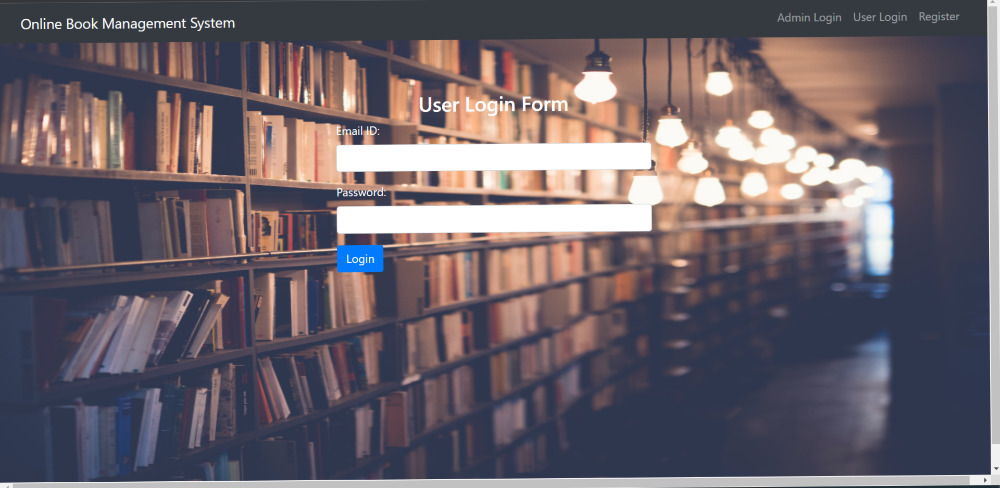
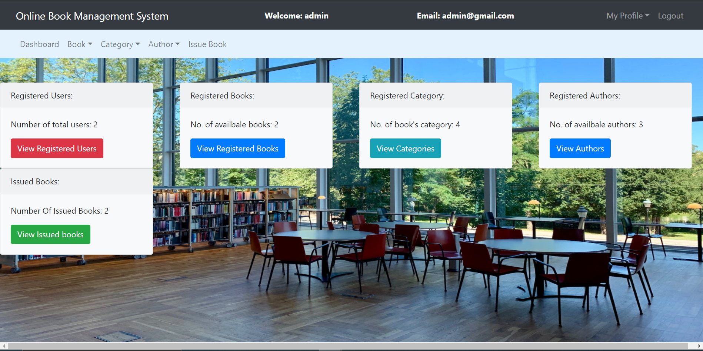
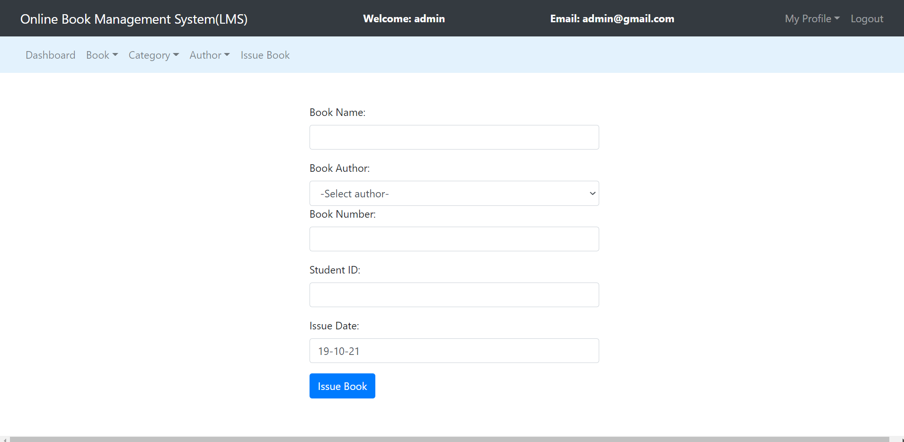

# Online_Library_Management_System
An interactive web portal for automating various manual processes done by librarian.

## Abstract

Manual process of keeping student records, book records, account details, managing books is very difficult. There are various problems also faced by the user in library such as finding any particular book, information whether book is available or not, etc. To eliminate this manual system, **Library Management System** has been developed.

## Core Features

 

 
 

- **Issuing** and **returning** books
- Admin can read information about any member
- Admin can track the books issued by a particular student
- Admin can **add/remove any user**(student).
- Admin can **add/delete books**
- Admin can **add/delete authors**
- Librarian can update the availability status of the books

## Additional Features

**Admin Dashboard** deal with the following : 

- Displaying all user records.

- Displaying all books records.

- Update Book Records.

- Delete Book Records

- Add Book Records

- Add Authors Records

- Delete Authors Records

## Technology Stack Used

 

 
 

- Front End - **HTML**, **CSS**, **JavaScript**
- Back End - **PHP**
- Database - **MySql**

## Requirements

The source code of this project is written in **PHP**. So, you'll require **WAMP/XAMPP/MAMP** to run this project.

## Installing 

  

- Download [WAMP](http://www.wampserver.com/en/)
- Download [XAMPP](https://www.apachefriends.org/download.html)
- Download [MAMP](https://www.mamp.info/en/)

## How to run?

1. Download this repo and extract it in your **www/htdocs** directory. 
2. Import the [database] from **db** folder. 
3. Run **`localhost/{YOUR FOLDER NAME}`**

